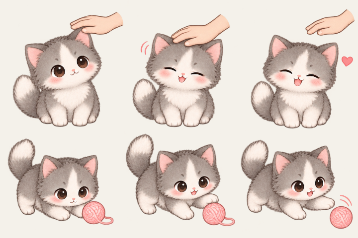
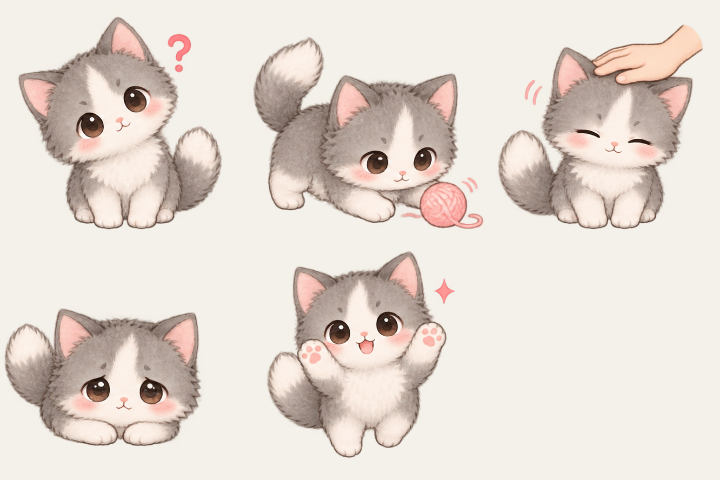
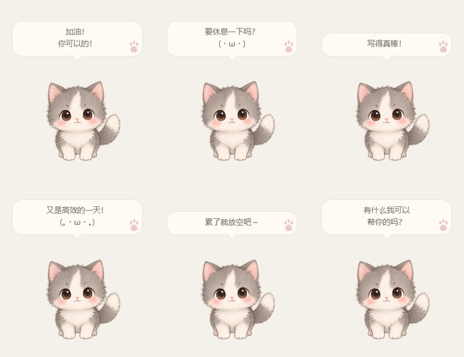

# 玉子 · 桌面宠物 v0.5.2

参照用户提供的灰白猫咪设定图制作的 Windows 桌宠。采用原生 C# / WPF，猫咪直接悬浮在桌面上，背景透明；附带独立动作面板与托盘菜单。

## 第五版：更自然的互动

被摸摸和玩毛线球使用三帧连续动画：摸头有手掌靠近、轻抚和收尾，毛线球会从注视到伸爪拨动。好奇、委屈和兴奋保留独立姿势。

当鼠标靠近待机、坐下或趴着的玉子时，她会朝鼠标方向转身、轻轻歪头并在状态栏显示“正在看着你”。鼠标离开，或玉子正在走路、睡觉、跳跃、拖动和互动时，视线会平滑复位并让当前行为优先。



## 第四版：玉子会自己互动

开启“自由活动”后，玉子会在待机、坐下或趴着时每隔一段时间自己选择一个小动作：好奇看看、玩毛线球、委屈或兴奋。首次自主互动会先等待约 12–22 秒，之后通常间隔 20–45 秒，并且不会连续重复同一个动作。

睡觉、跳跃、拖拽、移动、对话气泡或另一段互动进行时会暂缓调度；当前状态结束后继续等待。手动点击互动按钮、右键菜单和摸摸仍然立即响应。面板的“互动一下”标题旁会提示当前的自主互动规则。

## 第三版：互动动作

参考图中的互动动作已经接入桌面窗口和动作面板：好奇、玩毛线球、被摸、委屈、兴奋。每个动作使用独立的透明素材帧，点击互动按钮或右键菜单即可播放；动作结束后回到之前的基础陪伴状态。

- 单击猫咪会播放“被摸摸”，睡着时会先醒来；正在移动时会暂停移动再回应。
- 面板新增“互动一下”区域，右键猫咪也可直接选择 5 个互动动作。
- 互动动作会短暂暂停随机气泡，手动触发时会配合简短回应；拖拽、睡觉和跳跃仍然优先。
- 互动动作带轻微的上下弹动，素材中的问号、感叹号、爱心、毛线球和手掌装饰保留参考图的轻盈感觉。
- 自主互动使用同一套动作帧和状态机，结束后保留原来的自由活动状态。



## 第二版：随机对话气泡

玉子会在头顶显示参考图中的六句文案：

- 加油！你可以的！
- 要休息一下吗？
- 写得真棒！
- 又是高效的一天！
- 累了就放空吧～
- 有什么我可以帮你的吗？

默认开启“随机聊聊天”，首次发言在欢迎语后较快出现，后续通常每隔 30–60 秒随机说一句。每句显示约 6 秒，带淡入淡出、气泡小尾巴与粉色爪印。六句按随机顺序轮流出现，避免连续重复。

- 在面板点击“说一句 ♡”可立即查看；猫咪右键菜单与托盘菜单也有“玉子，说一句”。
- 取消“随机聊聊天”即可暂停自动发言，仍可手动触发。开关会随其他偏好一起保存。
- 随机聊天独立于“自由活动”，手动让猫咪坐着时也能说话；收起面板后照常显示。
- 睡觉、拖拽、跳跃或已有互动气泡时会暂缓随机发言，结束后留出安静间隔再继续。
- 手动点击“说一句”会唤醒睡着的玉子。摸摸、动作切换等即时反馈优先显示。
- 面板左侧同步显示当前气泡，便于直接预览。



## 启动

- 首次下载源码后，双击 **启动玉子.cmd**。脚本会使用系统编译器完成构建并启动玉子，无需安装依赖。
- 构建完成后，也可以直接双击生成的 **玉子桌宠.exe**。
- 重复启动会唤出已有动作面板，不会出现多只猫咪。
- 要带到另一台 Windows 电脑，只需复制 `玉子桌宠.exe`。

运行环境：Windows 10 / 11，.NET Framework 4.x 与 WPF（通常随系统提供）；无需 Node.js、Python、下载依赖或联网。

## 已实现

| 动作 | 行为 |
| --- | --- |
| 待机 | 呼吸、眨眼、轻轻歪头 |
| 向左走 / 向右走 | 四帧步行动画，沿桌面移动，碰到工作区边缘转身 |
| 跑步 | 独立四帧跑步动画，速度为散步的 2.1 倍 |
| 坐下 / 趴下 | 切换独立姿势，保留轻微呼吸 |
| 睡觉 | 蜷缩睡姿、缓慢呼吸和浮动 Zzz |
| 跳跃 | 跃起后自动回到之前的动作 |
| 自由活动 | 随机切换待机、散步、坐下、趴下与睡觉 |
| 互动动作 | 好奇、毛线球、被摸、委屈、兴奋 |
| 自主互动 | 自由活动时按间隔自动播放小动作，忙碌状态会暂缓 |
| 鼠标感应 | 靠近静止的玉子时，她会看向鼠标并轻轻歪头 |

点击具体动作会停止自动切换；点击“自由活动”可重新开启。

## 操作

- 按住猫咪拖动；松手后从新位置继续活动。
- 鼠标靠近待机、坐下或趴着的玉子，她会看向你；无需点击。
- 单击摸摸：播放被摸互动、眯眼并冒爱心；睡着时会醒来。
- 双击跳跃；右键打开动作菜单。
- 右键菜单或面板的“互动一下”区域可选择好奇、毛线球、被摸、委屈和兴奋。
- 面板可调节体型、步速和是否置顶。
- “找回玉子”将猫咪放回主屏工作区右下方。
- 面板右上角关闭、收起按钮或 Esc 只收起面板，猫咪继续陪伴。
- 右键猫咪 → 打开动作面板，或双击系统托盘里的绿色爪印。
- “结束陪伴”、右键“退出玉子”或托盘“退出玉子”会完整退出。

位置、体型、步速、置顶、自由活动与随机聊天开关保存在 `%LOCALAPPDATA%\TamagoPet\settings.xml`。不需要管理员权限。

## 源码与构建

- `src/PetEngine.cs`：动作、移动、边界控制与设置序列化。
- `src/Interaction.cs`：5 个互动动作的状态、三帧映射、鼠标视线状态与自主互动调度。
- `src/App.cs`：透明桌面窗口、面板绑定、拖拽、托盘、基础动画、互动动画、鼠标感应与气泡渲染。
- `src/Dialogue.cs`：参考图六句文案、随机轮换、间隔和互动避让。
- `src/Panel.xaml`：原生动作面板。
- `assets/tamago-sprites.png`：内置 imagegen 生成的 16 帧透明动作图。
- `assets/tamago-interactions.png`：内置 imagegen 生成的 8 帧透明互动动作图。
- `assets/tamago-interaction-animations.png`：内置 imagegen 生成的摸头、毛线球连续动作图集。
- `assets/PROMPT.md`：素材生成方式、参考图处理说明与完整提示词。
- `build.ps1`：使用系统 .NET Framework 编译器构建。
- `test.ps1`：编译并运行动作引擎验证和原生界面冒烟验证。

在此目录运行：

```powershell
powershell.exe -NoProfile -ExecutionPolicy Bypass -File .\build.ps1
powershell.exe -NoProfile -ExecutionPolicy Bypass -File .\test.ps1
```

构建会更新 `bin/Tamago.exe` 与独立分发文件 `玉子桌宠.exe`。

## 验证与范围

已验证 5 个互动动作的按钮映射、6 个连续互动帧解码、被摸唤醒、移动暂停、阻塞暂停和生命周期；已验证两段互动的首帧、中间帧映射和鼠标感应的左右看向、歪头、离开复位；已验证自主互动的首次等待、随机间隔、忙碌暂缓、开关和连续防重复；验证日志与互动动作联系图位于 `output/`。

已验证随机发言间隔、整轮文案覆盖、跨轮防重复、开关持久化、旧版设置兼容、手动预览、互动避让与气泡淡入淡出；六句文案在三种体型下均通过边界检查，收起面板后也通过真实计时器发言验证。

已验证动作按钮、移动与边缘转向、跳跃回落、拖拽暂停逻辑、非法时间与设置恢复、16 帧解码、大小/速度调节、置顶开关、找回位置、面板收起与恢复。验证日志与渲染预览位于 `output/`。

已人工查看面板、全部动作帧与六句气泡的渲染截图。原生鼠标拖动手势、多显示器热插拔、不同屏幕缩放比例与长时间运行仍建议在实际使用中继续验证。

第五版在基础动作、随机气泡和自主互动上加入两段多帧互动动画与本地鼠标感应，不包含自由输入的 AI 对话、语音、联网功能或开机启动。猫咪为参考风格重新生成的角色素材，并非逐像素还原原图。
