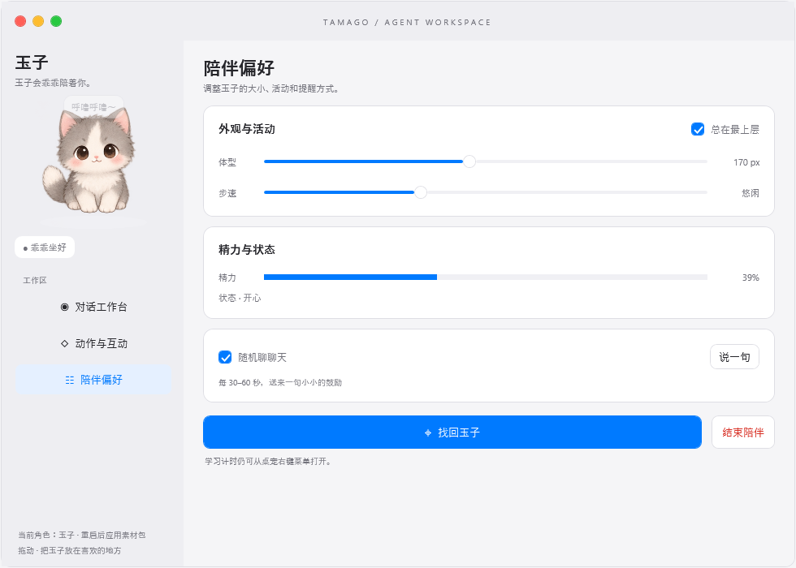
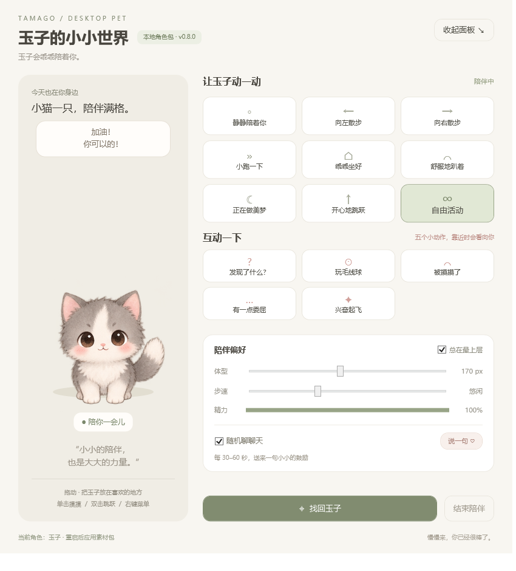
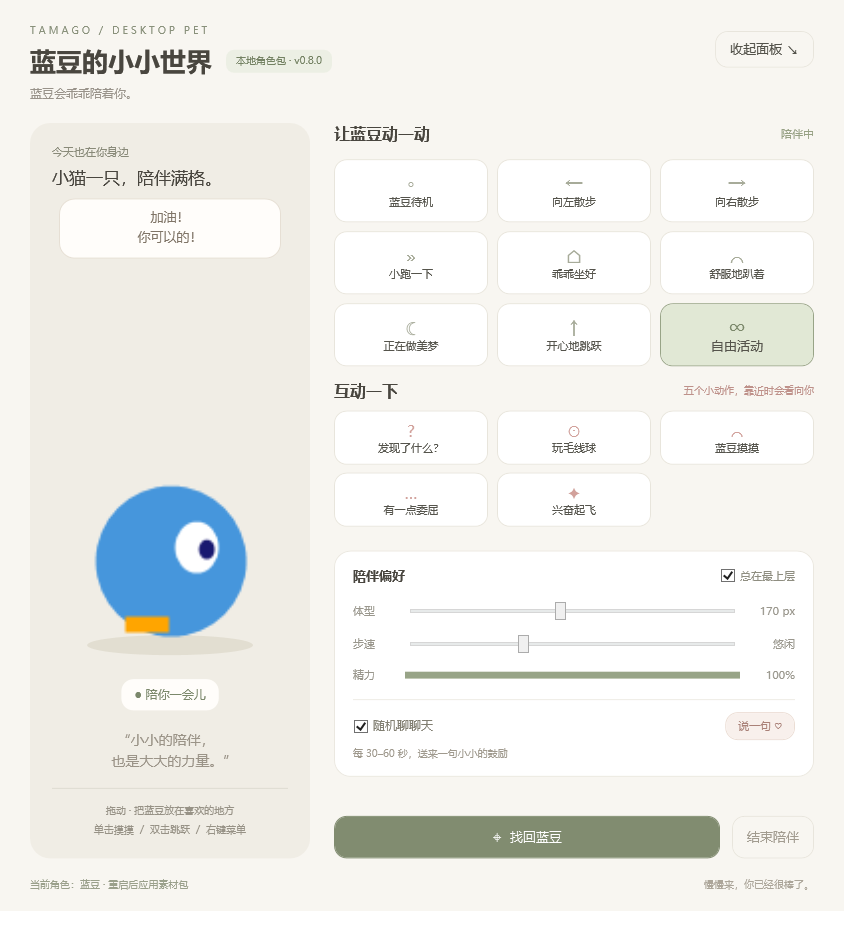
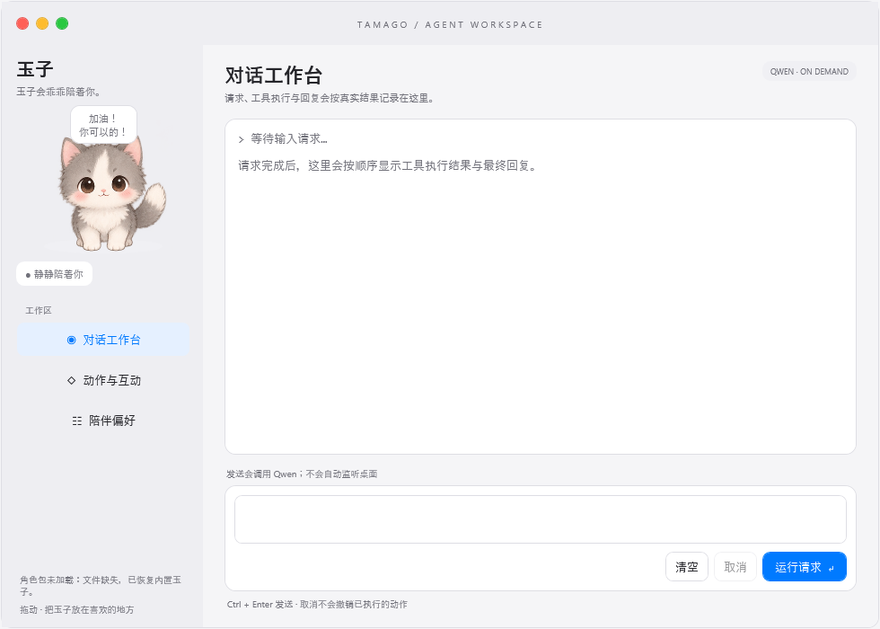
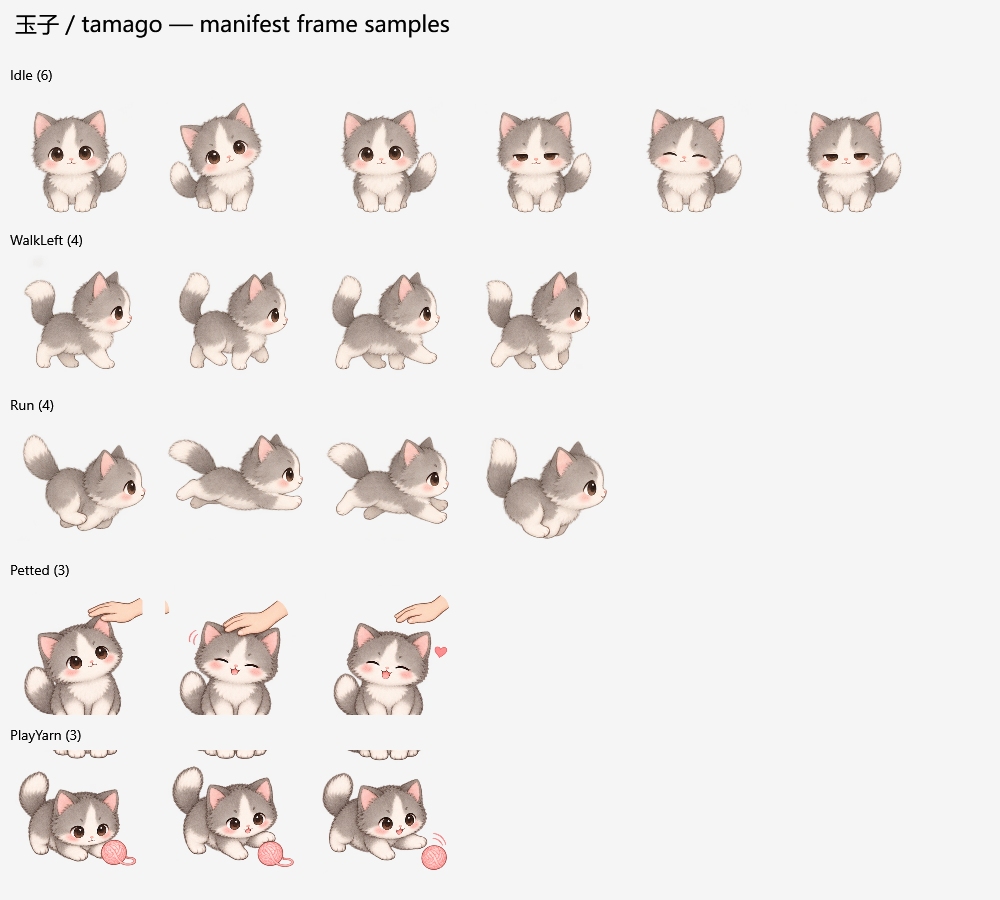
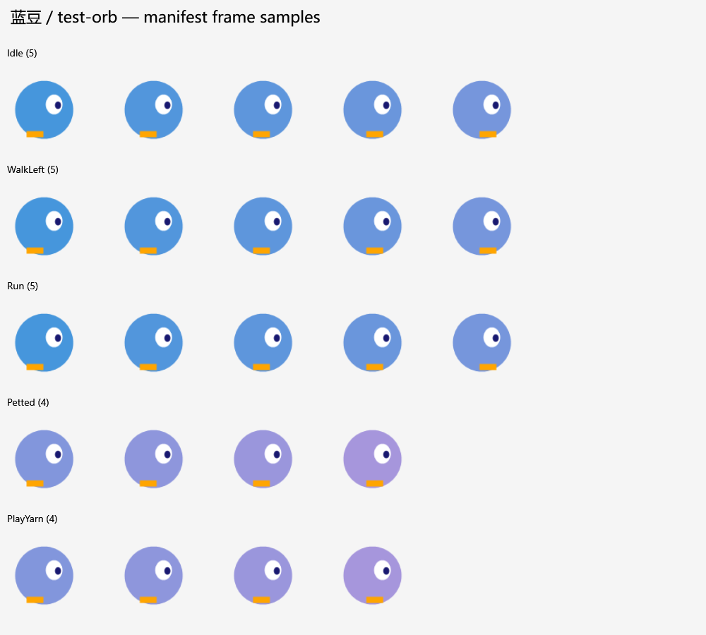
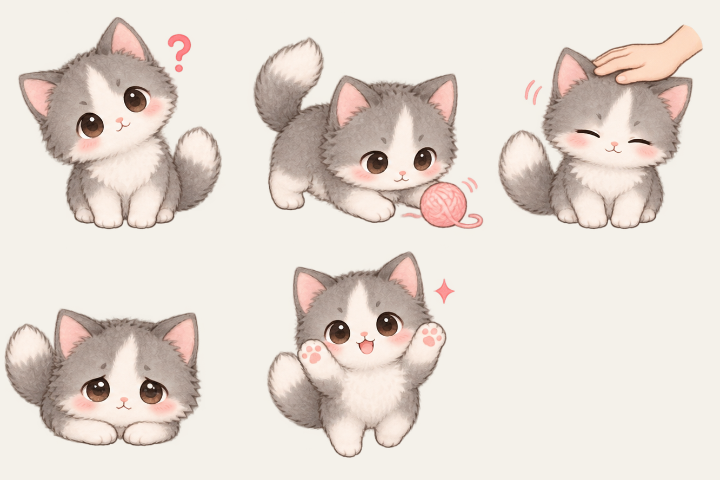
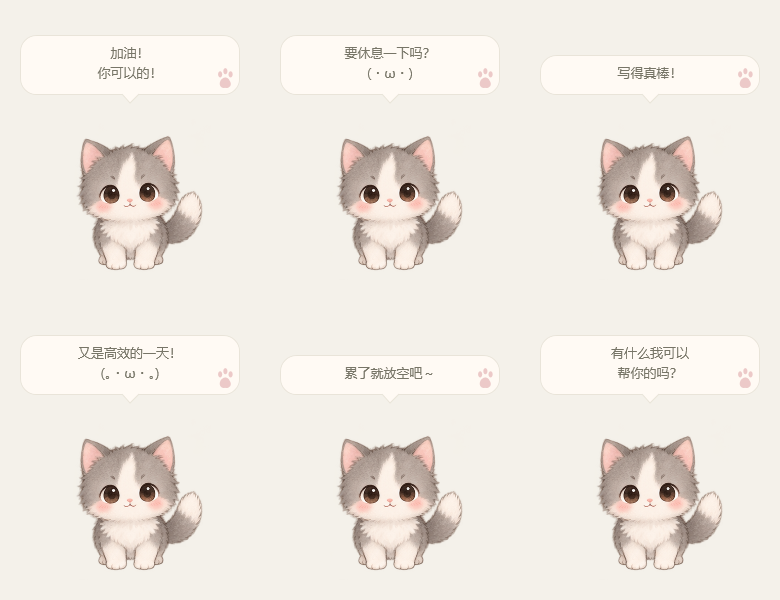

# 玉子 · 桌面宠物 v0.10.0

参照用户提供的灰白猫咪设定图制作的 Windows 桌宠。采用原生 C# / WPF，猫咪直接悬浮在桌面上，背景透明；附带独立动作面板与托盘菜单。

## Qwen Model Adapter V1

`QwenModelAdapter` 把现有 `IAgentModelAdapter` 接到阿里云百炼北京地域的 `qwen3.8-flash` Chat Completions 接口。每轮只发送当前请求、桌宠快照、工具反馈和 Runtime 允许的工具；模型返回的单个工具调用交由 `AgentRuntime` 和 `AgentToolRouter` 校验、执行。适配器不保存跨请求对话，也不接入聊天界面。请求关闭思考和并行工具调用，以适配 V1 的时限与串行调用契约。

API Key 只从运行进程的 `DASHSCOPE_API_KEY` 环境变量读取。请在 Windows 环境变量设置北京地域的百炼 API Key，重新打开终端后执行：

```powershell
powershell.exe -NoProfile -ExecutionPolicy Bypass -File .\build.ps1
$run = Start-Process -FilePath .\bin\Tamago.exe -ArgumentList '--qwen-agent-smoke' -PassThru -Wait
Get-Content .\output\qwen-agent-smoke.txt
$run.ExitCode
```

此显式联调模式用独立桌宠实例执行一次固定的 `set_action(Sit)` 请求，检查工具结果和模型最终回复，随后自动退出；不读写日常设置或学习记录。报告位于被 Git 忽略的 `output/qwen-agent-smoke.txt`，不包含 API Key。若没有配置 Key，联调在发起网络请求前失败。普通启动不会请求模型。自动测试使用假 HTTP 响应，不消耗真实 API 调用。

## Agent Runtime V1

`AgentRuntime.RunAsync(AgentRequest, CancellationToken)` 提供一次按需请求的完整循环：读取 `IAgentPetPort` 快照 → 将快照与工具定义交给 `IAgentModelAdapter` → 接收明确的 `ModelDecision.Final(...)` 或 `ModelDecision.Call(...)` → 校验并执行工具 → 重新读取状态，将结构化结果反馈给适配器 → 返回 `AgentRunResult`。最终回复只返回给调用方；只有模型显式调用 `speak` 才会显示宠物气泡。普通启动不会实例化模型适配器，也没有自动触发请求或聊天界面。

`AgentToolRouter` 固定公开 `set_action`、`play_interaction`、`speak`、`set_automatic`、`start_study`、`end_study` 六种工具。每项都有 JSON 参数描述，Router 在调用 Port 前再次校验名称、参数类型、取值和请求级允许名单；模型无法通过工具名触及 UI、动画或底层字段。`play_interaction` 不允许伪造 `Petted`。调用方可以通过 `AgentRequest.AllowedTools` 缩小一次请求的工具范围；不指定时公开全部六项。

每次只处理一个请求；每次请求最多 4 轮模型决策、3 次串行工具调用。模型决策的总时间预算默认 30 秒，状态读取和一次 Port 调用默认分别限时 5 秒。`Busy`、学习存储失败等结果会反馈给模型，但不再执行新的工具；最终回复会用确定的失败文案，避免模型误报成功。非法工具调用可在剩余调用额度内纠正一次。已经提交的 Port 指令不会因请求取消而重试；若超过 Port 等待时间，结果标为 `ExecutionUnknown`，提示用户核对实际状态。

实现位于 `src/AgentRuntimeContracts.cs`、`src/AgentToolRouter.cs` 和 `src/AgentRuntime.cs`。`src/AgentRuntimeTests.cs` 用假模型和假 Port 覆盖成功闭环、上限、忙碌、非法调用、存储失败、超时、取消及并发请求；`test.ps1` 仍运行原有 WPF 和角色包回归。Runtime 不绑定具体模型或聊天 UI，也不保存对话历史。

## Agent Ready V1

`IAgentPetPort` 是未来进程内 Agent 的唯一桌宠入口。`ReadAsync()` 返回一次性、不可修改的 `PetAgentSnapshot`：角色名、动作、生命状态、精力、自由活动和随机聊天开关、拖动/互动/陪伴、当前气泡，以及学习阶段、剩余时间和今日统计。接口不提供 WPF 控件、动画帧、`PetEngine` 或可写的底层状态。跨线程调用会切回 WPF Dispatcher，快照和指令都在 UI 线程读取或执行。

受控指令为 `SetActionAsync`、`PlayInteractionAsync`、`SpeakAsync`、`SetAutomaticAsync`、`StartStudyAsync` 和 `EndStudyAsync`，统一返回 `AgentCommandResult.Code`（`Applied`、`Busy`、`InvalidArgument`、`InvalidState`、`StorageUnavailable`、`ShuttingDown`）。动作选择与现有手动选动作一致，会关闭自由活动；互动保留自由活动设置。`Petted` 只代表真实用户触摸，Agent 不可触发。自定义气泡最多 80 字、两行，显示 6 秒；V1 不控制体型、速度、位置、置顶或随机聊天开关。

用户拖动、现有互动、摸摸陪伴、显示中的气泡和学习完成提醒优先；Agent 指令遇到这些状态返回 `Busy`，不自动排队。学习进行中只允许结束学习；学习读写失败会报告 `StorageUnavailable`，不绕过原有保存规则。接口定义在 `src/AgentContracts.cs`，WPF 线程切换、快照组合与命令校验在 `src/AgentPort.cs`；实际行为继续走 `PetApp` 与 `StudyApp` 的现有入口。本版不接模型、不提供聊天 UI 或进程通信。

## 学习陪伴模式 V1

右键玉子 → **陪我学习** → 选择 **25、45 或 60 分钟**。菜单实时显示剩余分秒和今日已完成次数、累计分钟；同一子菜单可选择**提前结束**。一次只能进行一段学习。

学习期间玉子安静坐下，低精力时趴下；暂停随机走动、随机对话、自主互动和鼠标追视。拖动、找回位置、调整大小和置顶照常使用；摸摸只亮爱心，不播放互动或气泡。动作、自由活动和“说一句”暂时停用，双击也不会跳跃。精力按原有休息速率恢复，不会被新的自动睡眠打断；生命状态继续观察精力和摸摸事件。

到期后播放当前角色包配置的基础反馈动作，并显示约 6 秒的简短提醒，随后恢复开始前的自由活动模式，或原来的手动动作与朝向。内置玉子使用跳跃与休息提醒，test-orb 示例包使用坐下与蓝豆的专属文案。`profile.json` 可设置 `studyCompletion`：

```json
{
  "studyCompletion": {
    "text": "完成 {minutes} 分钟学习啦！\n起来走走，休息一下吧～",
    "action": "Jump"
  }
}
```

`{minutes}` 会替换为本次完成的时长；文案最多 80 字、两行。动作必须是该素材包 `manifest.json` 已提供的基础动作名称（如 `Sit`、`Jump`），不能使用互动动作。缺省或无效字段分别回退到上述玉子文案与 `Jump`，旧角色包无需修改。提前结束立即恢复，不触发完成反馈，也不计入完成次数或分钟数；恰好到期时点击提前结束仍算完成。原有聊天开关不会被学习模式改写。开始时结束之前的短暂摸摸陪伴、清除未播完互动和旧气泡，结束后重新调度自主互动，避免旧动作突然接着播放。

学习数据单独保存在 `%LOCALAPPDATA%\TamagoPet\study.xml`，原有 `settings.xml` 格式保持不变。记录包括每日完成次数/分钟和当前任务的开始时间、绝对截止时间、恢复行为；状态转换采用临时文件与原子替换，渲染循环不读写学习文件。只有整段完成才累计所选时长，不统计提前结束的零散分钟。

- 关闭程序、拖动、打开菜单和电脑睡眠不会暂停截止时间。重启后继续未完成的计时；离线期间到期的任务会补记一次，并在启动时提醒。
- 跨午夜的完整任务计入**预定结束时的本地日期**，不拆分到两天；晚几天启动也不会把历史完成计入今天。每天的菜单自动切换日期，历史保留。
- 新任务必须先保存成功才开始。到期保存失败时保持安静、显示菜单错误并每 5 秒重试，保存成功后才确认完成；提前结束保存失败会保留当前任务，可再次操作。
- 记录损坏或无法读取时仍可正常使用桌宠，但暂停新建学习，菜单提示原因。退出程序，备份并修复 `study.xml`，或将其移到其他目录后重启，可重新开始；程序不会静默覆盖旧记录。
- V1 使用系统实际时间，手动调整系统时钟可能改变剩余时间（显示上限为所选时长）；不提供防改时钟机制、暂停计时或历史统计窗口。

实现分为 `src/StudySession.cs`（计时、统计、存储）和 `src/StudyApp.cs`（行为协调、菜单更新），沿用现有 WPF 窗口、素材和调度器。`src/StudyTests.cs` 覆盖三种时长、临界到期、提前结束、重启恢复、离线到期、跨日期、累计统计、坏数据/写入失败，以及学习与精力/拖动/交互的冲突。运行 `test.ps1` 同时执行原有回归和 WPF 集成测试，截图位于 `output/study-active-panel.png`、`output/study-complete-pet.png`、`output/pack-test-orb-study-complete-pet.png`。计时边界使用注入时间验证，无需真实等待 60 分钟；测试不会修改用户学习记录。

## 生命状态系统 V1

面板的精力条下方现在显示**平静、开心、疲惫、睡眠**四种生命状态。自动活动时，玉子开心会坐下来陪你一会儿，精力不足会停下待机，达到现有的低精力阈值后仍会自动睡觉，恢复精力后醒来。手动选的动作、跳跃、正在播放的互动和拖拽不会被状态建议覆盖。

摸摸会带来与 `companionSeconds` 一样长的开心时段；玩毛线球会开心 5 秒，兴奋互动会开心 3 秒。开心结束后，如果精力仍低，就显示疲惫。睡眠优先于其他状态。疲惫从精力不高于 `max(40, sleepAt + 12)` 开始，到高出该阈值 15 点后结束，避免临界值附近反复闪烁。疲惫时使用原有待机动作，因此精力仍可缓慢下降并触发原有自动睡眠。

实现位于 `src/PetLifeState.cs`：`Record(LifeEvent, ...)` 接收互动事件，`Observe(...)` 读取引擎的精力与动作，`Snapshot` 提供只读的状态、精力、剩余开心时长和建议动作。后续 AI Agent 可读取快照并发送受控事件；本版不调用模型、不保存生命状态，也不增加角色包动作类型。

`test.ps1` 在 Windows 上验证状态转换、精力阈值、开心计时、睡眠优先级、手动动作与拖拽保护，并用实际 WPF 画面验证疲惫待机、开心坐姿和自动睡眠。测试截图位于 `output/life-*-panel.png`。





## 本地角色素材包 V1

同一个 EXE 可读取本地角色包，更换名字、文案、皮肤及现有动作的动画。修改后**退出托盘中的程序，再重新启动**；关面板只是收起，并非退出。此版本没有热切换、商店或新增动作类型。

```text
玉子桌宠.exe                 # 或 bin/Tamago.exe
content/
  active-pet.json
  tamago-profile.json        # 无选择文件时的旧配置兼容入口
  pets/
    tamago/
      profile.json
      manifest.json
      tamago-sprites.png
      tamago-interactions.png
      tamago-interaction-animations.png
    test-orb/                # 蓝豆：用于验证的简易图形角色
      profile.json
      manifest.json
      orb.png
```

修改**正在运行的 EXE 旁边**的 `content/active-pet.json`：

```json
{"pet":"test-orb"}
```

改成 `{"pet":"tamago"}` 恢复玉子。包 ID 只允许 1–64 个 ASCII 字母、数字、下划线和连字符。复制自己的目录到 `content/pets/<id>/` 后同样切换即可，不需要重新编译。构建会复制整个 `content` 到 `bin/content`；直接运行根目录 EXE 时使用根目录 `content`。运行期间改文件不会改变已缓存素材。

`profile.json` 沿用 `PetProfile` 格式：`characterName`、`welcome`、`actionLabels`、六句 `dialogue`、`interactions`（label/line/duration/ambient）、`companionSeconds`、`energy`。面板、右键菜单和托盘使用当前名字及相关动作标签。合法 JSON 中缺省或超限的档案字段仍按旧规则使用字段默认值；坏 JSON 则导致整包回退。应用图标沿用玉子图标。

### manifest.json 格式

版本 `version` 必须为 `1`；`images` 将图片 ID 映射到包内 PNG 相对路径。`actions` 必须恰好包含 `Idle, WalkLeft, WalkRight, Run, Sit, Lie, Sleep, Jump`；`interactions` 必须恰好包含 `Curious, PlayYarn, Petted, Pout, Excited`。名称区分大小写。每个动作使用同一格式，例如下面是一个两帧基础动作条目（完整文件参考默认包）：

```json
{
  "version": 1,
  "images": {"body":"body.png"},
  "actions": {
    "WalkLeft": {
      "facing":"right", "mirror":true, "loop":true,
      "frames":[
        {"image":"body", "rect":[0,0,96,120], "time":0.12},
        {"image":"body", "rect":[96,0,96,120], "time":0.18}
      ]
    }
  }
}
```

- `rect` 为整数像素 `[x,y,width,height]`，以图片左上角为原点，宽高必须为正且完全位于图片内。帧可以重复、来自不同 PNG，帧数和图集布局自由。每个动作 1–128 帧，每帧 `time` 大于 0 且不超过 60。
- 基础动作：`time` 单位为秒；`loop:true` 循环，`false` 在最后一帧停留，直到行为引擎切换动作。跳跃仍由原引擎在约 0.85 秒后结束；动画不改变运动或精力规则。
- 互动动作：`loop` 必须为 `false`。`time` 是相对权重，整段序列缩放至 `profile.interactions.<name>.duration` 秒。例如四帧权重 `[1,2,3,4]`、duration=4，对应帧时长 `[0.4,0.8,1.2,1.6]`。拖拽等阻塞暂停互动计时；结束后回到基础动作。
- `facing` 表示原图朝向，只能是 `left` / `right`；`mirror:true` 时，原图朝向与目标朝向不同时水平翻转。基础移动使用引擎朝向，静止时可跟随鼠标视线；无视线的静止动作默认目标为右。互动使用引擎保留的朝向。`mirror:false` 始终保持原图，不翻转文字、手掌等装饰。默认玉子互动均不镜像。
- 可选 `touchedFrame` 是此动作 `frames` 的零基序号，用于非互动期间的短暂触摸余韵。玉子 Idle 配置了闭眼帧；通常可省略。
- 默认玉子复用了原来的三张 PNG、不等距裁切、六秒待机眨眼，以及摸摸/毛线球的三帧序列。测试包蓝豆为五帧基础动作、四帧互动，使用两行五列的另一张图集和不等时序。

### 校验与回退

启动先加载并校验整个包，成功后一次性应用档案和冻结缓存的帧；渲染循环不读文件。选择文件损坏、不支持的版本、缺文件、坏 PNG、动作缺失、非法帧引用、越界矩形或非法时序都会**整包恢复内置玉子**，面板底部显示简短原因，不混用失败包的文案。内置素材、manifest 和 profile 嵌入 EXE，外部包损坏也能启动。

图片路径限于包内：拒绝绝对路径、`..`、`.`、空路径段、盘符/备用数据流及符号链接/目录联接。最多 16 个 PNG，每文件不超过 32 MiB、边长不超过 8192、总像素不超过 3200 万；配置文件不超过 1 MiB。建议所有帧使用一致的画布尺寸与落脚点，避免缩放和位置抖动。

**没有 `active-pet.json`** 时使用内置玉子素材，并读取旧的 `content/tamago-profile.json`；旧文件也没有时直接用内置档案。存在选择文件但指定包失败时整包回退，不读取旧档案。

### Windows 回归验证

运行 `powershell -ExecutionPolicy Bypass -File .\test.ps1`。除行为/气泡回归外，测试校验加载、五帧/四帧与不等时序、左右镜像、缓存、缺失/损坏/非法路径/越界回退、旧配置兼容；WPF 测试实际执行 `Refresh` 检查素材引用、动作按钮、面板/右键/托盘档案和回退提示。

脚本复制同一 EXE 到隔离测试目录，只改变选择文件，分别重启测试包和缺失包，并比对 EXE 的 SHA-256。不会修改用户的源角色包或选择。结果位于 `output/engine-tests.txt`、`output/smoke-test.txt` 和 `output/pack-*-smoke.txt`。







## 第七版：内容配置包（兼容）

可执行文件旁新增 `content/tamago-profile.json`。角色名称、欢迎语、基础动作在状态栏和菜单中的名称、五个互动的台词和时长、自动互动候选、随机气泡、摸摸陪伴时长与精力节奏都可直接编辑，无需重新编译；修改后重启玉子即可生效。

旧配置仅在没有角色包选择文件时生效；新版本请编辑选中包的 `profile.json` 和 `manifest.json`。

## 第六版：精力与陪伴节奏

自由活动时，走路和跑步会消耗精力，坐下、趴下和睡觉会恢复精力。精力较低时玉子会自动进入睡眠，恢复后再醒来继续活动；面板中的精力条会实时显示当前状态。

摸摸玉子后会停留约 8 秒陪伴你，期间暂停自主动作和随机气泡，避免刚回应完就被下一次自动切换打断。手动选择其他动作或切换模式会立即结束这段陪伴。

## 第五版：更自然的互动

 被摸摸和玩毛线球使用三帧连续动画：摸头有手掌靠近、轻抚和收尾，毛线球会从注视到伸爪拨动。好奇、委屈和兴奋保留独立姿势。

当鼠标靠近待机、坐下或趴着的玉子时，她会朝鼠标方向转身、轻轻歪头并在状态栏显示“正在看着你”。鼠标离开，或玉子正在走路、睡觉、跳跃、拖动和互动时，视线会平滑复位并让当前行为优先。


## 第四版：玉子会自己互动

开启“自由活动”后，玉子会在待机、坐下或趴着时每隔一段时间自己选择一个小动作：好奇看看、玩毛线球、委屈或兴奋。首次自主互动会先等待约 12–22 秒，之后通常间隔 20–45 秒，并且不会连续重复同一个动作。

睡觉、跳跃、拖拽、移动、对话气泡或另一段互动进行时会暂缓调度；当前状态结束后继续等待。手动点击互动按钮、右键菜单和摸摸仍然立即响应。面板的“互动一下”标题旁会提示当前的自主互动规则。

## 第三版：互动动作

参考图中的互动动作已经接入桌面窗口和动作面板：好奇、玩毛线球、被摸、委屈、兴奋。每个动作使用独立的透明素材帧，点击互动按钮或右键菜单即可播放；动作结束后回到之前的基础陪伴状态。

- 单击猫咪会播放“被摸摸”，睡着时会先醒来；正在移动时会暂停移动再回应。
- 面板新增“互动一下”区域，右键猫咪也可直接选择 5 个互动动作。
- 互动动作会短暂暂停随机气泡，手动触发时会配合简短回应；拖拽、睡觉和跳跃仍然优先。
- 互动动作带轻微的上下弹动，素材中的问号、毛线球和手掌装饰保留参考图的轻盈感觉。
- 自主互动使用同一套动作帧和状态机，结束后保留原来的自由活动状态。



## 第二版：随机对话气泡

玉子会在头顶显示参考图中的六句文案：

- 加油！你可以的！
- 要休息一下吗？
- 写得真棒！
- 又是高效的一天！
- 累了就放空吧～
- 有什么我可以帮你的吗？

默认开启“随机聊聊天”，首次发言在欢迎语后较快出现，后续通常每隔 30–60 秒随机说一句。每句显示约 6 秒，带淡入淡出、气泡小尾巴与粉色爪印。六句按随机顺序轮流出现，避免连续重复。

- 在面板点击“说一句 ♡”可立即查看；猫咪右键菜单与托盘菜单也有“玉子，说一句”。
- 取消“随机聊聊天”即可暂停自动发言，仍可手动触发。开关会随其他偏好一起保存。
- 随机聊天独立于“自由活动”，手动让猫咪坐着时也能说话；收起面板后照常显示。
- 睡觉、拖拽、跳跃或已有互动气泡时会暂缓随机发言，结束后留出安静间隔再继续。
- 手动点击“说一句”会唤醒睡着的玉子。摸摸、动作切换等即时反馈优先显示。
- 面板左侧同步显示当前气泡，便于直接预览。



## 启动

- 首次下载源码后，双击 **启动玉子.cmd**。脚本会使用系统编译器完成构建并启动玉子，无需安装依赖。
- 构建完成后，也可以直接双击生成的 **玉子桌宠.exe**。
- 程序和系统托盘会显示玉子的灰白猫咪图标，图标包含 16 至 256 像素的多个尺寸，适合任务栏、桌面和资源管理器显示。
- 重复启动会唤出已有动作面板，不会出现多只猫咪。
- 要带到另一台 Windows 电脑，请复制 `玉子桌宠.exe` 和同级的 `content` 文件夹；删除 `content` 也能启动，只会使用默认内容。

运行环境：Windows 10 / 11，.NET Framework 4.x 与 WPF（通常随系统提供）；无需 Node.js、Python、下载依赖或联网。

## 已实现

| 动作 | 行为 |
| --- | --- |
| 待机 | 呼吸、眨眼、轻轻歪头 |
| 向左走 / 向右走 | 四帧步行动画，沿桌面移动，碰到工作区边缘转身 |
| 跑步 | 独立四帧跑步动画，速度为散步的 2.1 倍 |
| 坐下 / 趴下 | 切换独立姿势，保留轻微呼吸 |
| 睡觉 | 蜷缩睡姿、缓慢呼吸和浮动 Zzz |
| 跳跃 | 跃起后自动回到之前的动作 |
| 自由活动 | 随机切换待机、散步、坐下、趴下与睡觉 |
| 互动动作 | 好奇、毛线球、被摸、委屈、兴奋 |
| 自主互动 | 自由活动时按间隔自动播放小动作，忙碌状态会暂缓 |
| 鼠标感应 | 靠近静止的玉子时，她会看向鼠标并轻轻歪头 |

点击具体动作会停止自动切换；点击“自由活动”可重新开启。

## 操作

- 按住猫咪拖动；松手后从新位置继续活动。
- 鼠标靠近待机、坐下或趴着的玉子，她会看向你；无需点击。
- 单击摸摸：播放被摸互动、眯眼并冒爱心；睡着时会醒来。
- 双击跳跃；右键打开动作菜单。
- 右键菜单或面板的“互动一下”区域可选择好奇、毛线球、被摸、委屈和兴奋。
- 面板可调节体型、步速和是否置顶。
- “找回玉子”将猫咪放回主屏工作区右下方。
- 面板右上角关闭、收起按钮或 Esc 只收起面板，猫咪继续陪伴。
- 右键猫咪 → 打开动作面板，或双击系统托盘里的绿色爪印。
- “结束陪伴”、右键“退出玉子”或托盘“退出玉子”会完整退出。

位置、体型、步速、置顶、自由活动与随机聊天开关保存在 `%LOCALAPPDATA%\TamagoPet\settings.xml`。不需要管理员权限。

## 源码与构建

- `src/PetEngine.cs`：动作、移动、边界控制与设置序列化。
- `src/Interaction.cs`：5 个互动动作的状态、三帧映射、鼠标视线状态与自主互动调度。
- `src/App.cs`：透明桌面窗口、面板绑定、拖拽、托盘、基础动画、互动动画、鼠标感应与气泡渲染。
- `src/Dialogue.cs`：参考图六句文案、随机轮换、间隔和互动避让。
- `src/PetProfile.cs`：内容配置包读取、校验和默认值回退。
- `src/Panel.xaml`：原生动作面板。
- `content/tamago-profile.json`：可编辑的角色、动作、互动、对话与精力配置。
- `assets/tamago-sprites.png`：内置 imagegen 生成的 16 帧透明动作图。
- `assets/tamago-interactions.png`：内置 imagegen 生成的互动动作图集，当前启用其中 5 个姿势。
- `assets/tamago-interaction-animations.png`：内置 imagegen 生成的摸头、毛线球连续动作图集。
- `assets/PROMPT.md`：素材生成方式、参考图处理说明与完整提示词。
- `build.ps1`：使用系统 .NET Framework 编译器构建。
- `test.ps1`：编译并运行动作引擎验证和原生界面冒烟验证。

在此目录运行：

```powershell
powershell.exe -NoProfile -ExecutionPolicy Bypass -File .\build.ps1
powershell.exe -NoProfile -ExecutionPolicy Bypass -File .\test.ps1
```

构建会更新 `bin/Tamago.exe` 与独立分发文件 `玉子桌宠.exe`。

## 验证与范围

已验证 5 个互动动作的按钮映射、6 个连续互动帧解码、被摸唤醒、移动暂停、阻塞暂停和生命周期；已验证两段互动的首帧、中间帧映射和鼠标感应的左右看向、歪头、离开复位；已验证自主互动的首次等待、随机间隔、忙碌暂缓、开关和连续防重复；验证日志与互动动作联系图位于 `output/`。

已验证随机发言间隔、整轮文案覆盖、跨轮防重复、开关持久化、旧版设置兼容、手动预览、互动避让与气泡淡入淡出；六句文案在三种体型下均通过边界检查，收起面板后也通过真实计时器发言验证。

已验证动作按钮、移动与边缘转向、跳跃回落、拖拽暂停逻辑、精力消耗与自动休息唤醒、非法时间与设置恢复、16 帧解码、大小/速度调节、置顶开关、找回位置、面板收起与恢复。验证日志与渲染预览位于 `output/`。

已人工查看面板、全部动作帧与六句气泡的渲染截图。原生鼠标拖动手势、多显示器热插拔、不同屏幕缩放比例与长时间运行仍建议在实际使用中继续验证。

第十版增加学习陪伴、到期休息提醒与本地每日统计；第九版增加由精力与互动驱动的生命状态；第八版支持重启生效的本地角色素材包；第七版将角色文案、互动、气泡与精力节奏整理为内容配置包；第六版提供精力节奏与摸摸后的短暂陪伴，前一版提供两段多帧互动动画与本地鼠标感应。本项目不包含自由输入的 AI 对话、语音、联网功能或开机启动。猫咪为参考风格重新生成的角色素材，并非逐像素还原原图。
