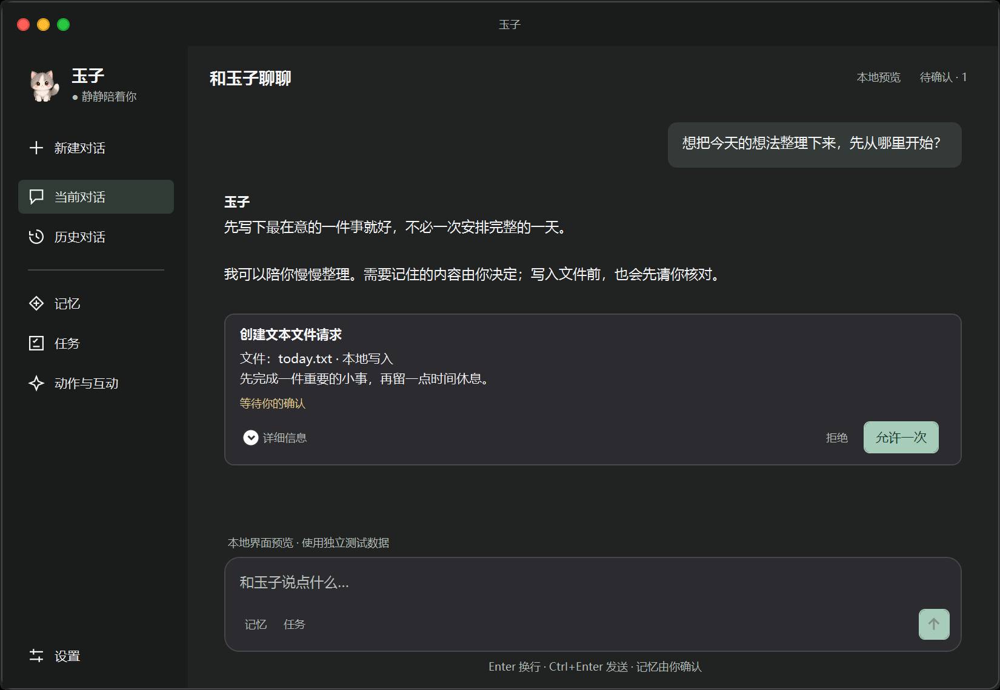

# Windows 对话界面与 UI Quality Pass

本轮只改变 WPF 呈现、导航与测试宿主；Core、Memory、Permission、Task 和 Persistence 的业务实现沿用原版本。已有未提交的 V3 修改保留。



## 审计结论

- 原窗口使用 Segoe UI，中文依赖后备字体；大量辅助文字仅 10–11 DIP，较淡的文字叠加按钮整体透明度进一步降低可读性。
- 没有包裹聊天区域的 Viewbox、ScaleTransform 或整体缩放。变换只作用于宠物图片。原本已开启布局舍入和像素对齐，但未显式指定文字排版模式。
- 原 Manifest 仅声明 System DPI aware，未明确 TargetFramework / WPF 每显示器 DPI 行为。
- 本机实际为 144 DPI（150%）。原测试截图硬编码 96 DPI，会造成与原生窗口不同的文字采样；不能用该旧图单独评价屏幕文字质量。
- Assistant 与任务采用相同的大卡片，Composer 初始高度过大；导航依赖宽度不一的 Unicode 图标，开发说明占据侧栏底部。
- 滚动条除了模板覆盖问题，还继承了系统最小宽度；仅设置 Width 不足以变细。深色 Expander 与 ComboBox 原本会漏出系统黑字和白底。

## 呈现与操作

- 侧栏 204 DIP：小头像、状态、新建/当前/历史对话、记忆、任务、动作与互动；设置固定在底部。图标统一为 16 DIP 矢量 Path，行高至少 40 DIP，选择状态使用柔和的灰绿色。
- 正文与 Composer 共享最多 840 DIP 阅读宽度，小窗口自然收缩。右侧抽屉在宽窗口并排显示，在窄窗口覆盖显示；关闭按钮与 Escape 可收起。
- 用户消息为右侧轻量气泡；玉子回复直接排在聊天背景上；工具与权限才使用结构化卡片。权限默认显示操作、目标、风险、正文和当前确认状态。内部 ID、哈希、执行记录放入折叠详情。
- 权限按钮继续携带卡片自身的任务 ID、Permission ID 和绑定哈希。切换所选任务不改变按钮目标，过期或已消费的卡片交给 Core 拒绝；未知结果只显示人工核对入口。
- Composer 输入高度从 32 DIP 自然增长至 152 DIP，超出后内部滚动。Enter 换行，Ctrl+Enter 发送；空输入禁用发送，处理期间显示停止操作。记忆、任务使用次级按钮。
- 右键用户/玉子消息可复制或“请求记住这条消息”；记忆面板可查看、修正、忘记。记忆变更始终产生单次权限卡片，没有自动写入。
- 历史入口展示既有用户主动保存的检索对话。当前普通聊天仍只有本次运行最多 6 轮上下文，没有新增多会话数据库或自动保存。
- 连接、Fake Provider、角色包信息与原始工具详情在高级面板，默认隐藏。普通聊天仍沿用已有按需 Qwen 连接；本地记忆与文件流程沿用 Fake Provider。

## 字体、主题与 DPI

`Panel.xaml` 的 Window.Resources 是轻量的设计变量层；`PanelTheme` 是语义颜色的唯一运行时来源，支持浅色、深色和系统高对比度。

| 类别 | 约定 |
| --- | --- |
| 字体 | 系统 Microsoft YaHei UI，后备 Segoe UI；不携带字体文件 |
| Typography | Caption 12 / Body 14 / Message 15 / Title 18 / PageTitle 22 DIP |
| 字重 | 正文 Normal，标题与强调 SemiBold，不使用 Light |
| 间距 | 4 / 8 / 12 / 16 / 24 DIP；消息、按钮和面板有共享 inset/gap |
| 圆角 | 6 / 10 / 16 DIP |
| 颜色 | Background、Surface、Primary、Secondary、Disabled、Accent、Hover、Selected、Danger、Success |
| 滚动条 | 10 DIP 命中宽度、6 DIP 视觉滑块，显式清除系统最小宽度；支持滚轮、拖动与键盘 |

主窗口保持不透明，开启 UseLayoutRounding、SnapsToDevicePixels 和 Display 文字排版。ClearType 仅设置在有不透明底色的主内容树；透明宠物窗口不继承这一设置。按钮 hover 改变独立背景覆盖层，禁用状态使用文字色，不再对整棵文字树降低透明度。边框焦点反馈不改变宽度，避免布局跳动。

程序集明确声明 .NET Framework 4.8；启动时在任何 WPF HWND 创建前启用 DPI 开关，Manifest 声明 PerMonitorV2 / PerMonitor。Windows 10/11 上需要 .NET Framework 4.8 或更新版本。没有修改系统 DPI、ClearType、字体注册表或网络设置。

依据：[Microsoft 每显示器 DPI 示例](https://github.com/microsoft/WPF-Samples/blob/main/PerMonitorDPI/readme.md)、[ClearType 与透明背景](https://learn.microsoft.com/en-us/dotnet/api/system.windows.media.renderoptions.cleartypehint?view=netframework-4.8.1)、[Microsoft YaHei 系统字体](https://learn.microsoft.com/en-us/typography/font-list/microsoft-yahei)。

## 验证与本地预览

```powershell
powershell.exe -NoProfile -ExecutionPolicy Bypass -File .\test.ps1 -BuildDirectory .\output\ui-quality\bin
.\output\ui-quality\bin\Tamago.exe --ui-preview
```

独立构建目录避免覆盖正在运行的 EXE。`--ui-preview` 只使用合成消息、Fake 响应与 `%TEMP%\TamagoUiTests\<随机 ID>` 下的独立存储，供实际窗口检查；不会读取日常设置或调用真实模型。测试存储从工作区移到 TEMP，避免工作区文件被外部扫描时干扰原子替换；生产目录不变。

测试覆盖原有 Core / Memory / Durable Task、学习模式和角色包；新增 ViewModel、卡片与审批绑定回归，以及 Composer 增长/滚动/占位、真实 HWND DPI awareness、字体继承和无文本缩放变换检查。自动截图按实际视觉 DPI 输出，不再固定为 96 DPI。

`quality-dpi-100/125/150.png` 在 96 / 120 / 144 DPI 下重新设置 WPF 根视觉 DPI、测量和渲染，属于离屏验证，不是把一张图缩放三次。当前机器另有原生 150% 窗口验证。100% / 125% 的真实显示器、混合 DPI 跨屏拖动仍需在对应硬件上验收；本轮没有改变用户 Windows 缩放设置。离屏图也不等同于屏幕 ClearType 子像素观感。

2026-10-01 最终验证：Build 成功（保留 PackTests 中两条既有 FormattedText 过时提示）；Core 211 项、引擎/会话/ViewModel 847 项、主 WPF smoke、test-orb 与 missing-package 重启回归全部通过。实际 HWND 为 PerMonitorV2，144 DPI / WPF scale 1.5；字形诊断解析到系统 MSYH.TTC。已检查浅/深色、高对比度、最小窗口、宽窗口抽屉和三档 DPI 图，并通过 Win32 PrintWindow 捕获运行中的原生预览窗口。浅色辅助文字对聊天背景的对比度约 5.56:1，深色约 8.43:1。

本轮开始与结束的 Core/Persistence 源文件哈希一致。`git diff --check` 通过；保留原有工作区修改，未 commit / push。

核心文件：`Panel.xaml`、`PanelTheme.cs`、`AgentMessageCard.cs`、`AgentWorkspaceViewModel.cs`、`AgentWorkspaceApp.cs`、`AgentChatApp.cs`、`App.cs`、`app.manifest`。UI 测试位于 `AgentWorkspaceTests.cs`、`AgentWorkspaceViewModelTests.cs`、`UiQualityTests.cs`。
