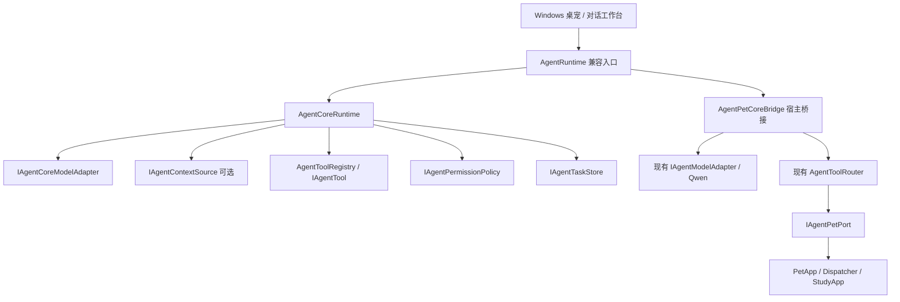

# Core Foundation V1

本阶段在现有 C# / .NET Framework 工程内抽出通用 Agent Core，迁移同一条请求循环，复用已工作的桌宠、学习陪伴和 Qwen 模块。没有新增真实模型调用、外部服务、数据库、依赖包、后台调度或系统配置。Swift/macOS 的独立实现保持原状。

## 实际依赖关系



Core 源码没有 `PetApp`、`PetEngine`、`PetAction`、WPF、HTTP、Qwen 或素材包依赖。宿主将具体状态投影成不可变的 JSON 对象，将受控能力注册为工具。桌宠是一个宿主和工具域；将来 CLI 或 Web 可以构造自己的 Core 实例和宿主，不需要模拟桌宠。

生产构建继续将这些源码编入一个 `Tamago.exe`，维持现有单 EXE 分发方式。`test-core.ps1` 单独编译 `Tamago.Core.dll`，控制台测试仅引用该 DLL 与框架 JSON 库，证明 Core 可以脱离 UI 执行。目前仍依赖 .NET Framework / `System.Web.Extensions`，这不是已经完成的跨平台 .NET SDK 迁移。

## 接口与职责

| 接口 / 类型 | 当前职责 |
| --- | --- |
| `AgentCoreRequest` | 输入、复制后的请求工具允许名单、可选宿主上下文；不能提供权限授予 |
| `AgentContextSnapshot` / `IAgentContextSource` | 有捕获时间的只读 JSON 对象；状态源可省略，缺省状态为 `{}` |
| `IAgentCoreModelAdapter` / `ModelDecision` | 接收结构化输入、工具、真实反馈，返回明确的 Final 或单个 ToolCall |
| `IAgentTool` / `AgentToolRegistry` | 显式注册工具、严格参数验证、结构化结果；不能动态加载 CLR 类型或执行任意字符串 |
| `AgentToolDefinition` | 工具名、描述、参数 JSON Schema、权限 scope、是否必须确认 |
| `IAgentPermissionPolicy` | 宿主控制工具暴露和每次执行授权；模型文本不能修改策略 |
| `AgentApprovalRequest` | TaskId、RunId、工具定义、CallId、名称及原始参数，用于未来审批绑定 |
| `IAgentTaskStore` / `AgentTaskSnapshot` | 当前内存任务检查点、运行状态、轮次、工具结果摘要 |
| `AgentCoreResult` | TaskId、RunId、结束码、回复、最新快照、完整本轮工具反馈、可选审批请求 |
| `IAgentMemory` | 查询、保存、忘记的扩展契约；未接入 Runtime，也没有存储实现 |
| `IAgentScheduler` | 安排/取消一次定时请求的扩展契约；没有计时器或主动任务实现 |
| `IAgentModelProvider` | 宿主选择模型适配器的扩展契约；没有新 Provider、凭据读取或 API |

`AgentRuntime`、`IAgentModelAdapter`、`AgentRequest`、`AgentRunResult`、`IAgentPetPort` 的现有调用签名保持兼容。共享决策和结果枚举移入 Core，原枚举值保持顺序，仅追加 `AwaitingApproval`、`StateUnavailable`、`ApprovalRequired`。旧工具定义三参数构造仍可用，但通用工具缺省属于 `unclassified` scope，不会自动获得授权。

`AgentPetCoreBridge` 包装现有模型契约，转交原始不可变的宠物快照与已限制容量的会话历史；Core 只依赖 JSON 投影。宠物工具桥接只授予 `pet` scope，继续复用 `AgentToolRouter.ValidateCall` 和 `ExecuteAsync`。实际动作与忙碌优先级仍归 Pet Port / 原有应用逻辑管理。学习存储格式、坏记录处理、重启恢复及角色包完全不迁移。

## 一次请求的生命周期

1. 验证输入（非空、最多 1000 字）。每个 Runtime 只接受一个进行中的请求；非法输入或并发 Busy 不创建任务。
2. 生成独立 TaskId 和 RunId，记录 `Queued` → `Running`。任务存储失败时，不调用模型或工具。
3. 读取宿主状态；没有状态源使用空 JSON。从注册表、宿主 scope 和请求允许名单的交集生成模型工具列表。
4. 调用模型，接收 `ModelDecision.Final(...)` 或 `ModelDecision.Call(...)`。每轮发送同一个请求上下文、最新状态和本轮累计的真实反馈。
5. 检查调用编号、名称、参数对象/大小、工具专属参数校验，并重新评估权限。拒绝调用没有副作用；非法调用最多有一次纠正机会。
6. 需要确认时返回 `AwaitingApproval`，记录 `WaitingForApproval` 和确切审批请求，立即停止模型循环，不调用 handler。本阶段没有可提交的批准凭证、审批 UI 或恢复接口。
7. 获准调用先写入“即将分发、结果未知”的检查点，再执行一次工具。状态保存失败或尚未分发前取消，均不执行。已分发后不自动重试或撤销。
8. 获取工具结果并重新读取状态；把结果码、有限 JSON 输出和新快照反馈给模型。超时、空结果或执行异常标为 `ExecutionUnknown`。
9. 最终回复受 Runtime 校验；Busy、InvalidState、存储失败或未知执行结果不能被模型描述为成功。保存终态后返回结果；保存失败返回 `StateUnavailable`，仍保留实际工具轨迹和审批信息。

任务状态为 `Queued`、`Running`、`WaitingForApproval`、`Succeeded`、`Failed`、`Cancelled`、`Blocked`。执行结果未知或状态存储故障映射到 `Blocked`；用户取消进入 `Cancelled`，其中仍可能包含已执行的动作。如果终态也无法保存，存储可能保留上一检查点，调用方必须以返回的 `StateUnavailable` 和工具轨迹为准，不能把旧检查点当成真实终态。终态和等待审批状态不能用旧快照重新打开。任务和运行目前一一对应；RunId 预留以后重试/继续的标识边界，本阶段没有恢复调度。

## 限制与失败处理

- 延续最多 4 轮模型决策、3 次工具尝试；无效和被拒绝的调用也消耗额度。模型累计预算默认 30 秒；单次状态读取与工具调用各默认 5 秒。
- `AgentScopePermissionPolicy` 默认不授予任何 scope。请求允许名单只能缩小宿主权限，不能为空值之外的“授权”来源；空列表表示不暴露工具。
- JSON Schema 用于向模型描述工具；Registry 仅验证它是有限 JSON 对象。严格字段、类型、取值校验由 handler 执行。新增工具必须实现无副作用的 `ValidateArguments`；既有桌宠校验复用原 Router。
- 策略或验证异常按拒绝处理；handler 发出后的异常按未知结果处理。没有自动重试。工具定义要求确认时，即使策略返回 Allow 也不能绕过确认。
- 参数对象最多 2048 字符；工具输出最多 8192 字符；状态/请求上下文最多 32768 字符；最终回复最多 2000 字符。宿主投影须自行筛选敏感信息，不能把凭据塞入上下文或工具输出。
- 状态与工具操作提交后使用有限等待，用户取消不能抹掉已经发生的操作。状态源、模型和 handler 应及时返回 Task，不能在调用前同步阻塞；这些是可信宿主代码，并非进程沙箱。忽略取消的模型或工具可能在超时后继续运行，但不会覆写已返回的任务结果。
- `InMemoryAgentTaskStore` 默认保留 128 项，容量满时淘汰最早已结束的任务。进行中和等待审批任务不会被淘汰；全满时拒绝新任务。未实现等待审批的取消/恢复/过期；宿主不得把此行为当作完整审批流程。
- 状态存储是同步、有限的内存接口，不能直接在实现里做阻塞磁盘或网络 I/O。未来持久任务存储需要增加异步/迁移/崩溃恢复语义后接入，不能把当前接口误当成已持久化的任务数据库。
- 普通任务记录只含身份、状态、轮次、工具名称/调用号/结果，不含全文输入、回复、快照或普通工具参数；待审批记录包含需要确认的精确参数，仅存在内存。现有会话历史仍由应用管理，最多 6 轮、24 KiB，退出后清空。

## 文件与验证

新增五个 `src/Core/*.cs`、`src/AgentPetCoreBridge.cs`、`tests/Core/AgentCoreTests.cs`、`tests/Core/Program.cs`、`test-core.ps1` 和本说明。修改兼容 Runtime、共享契约、Router、构建/测试脚本、Windows CI 和 README。没有修改 Pet Port、学习模块、角色包、UI 或 Qwen 源码。

```powershell
# 仅 Core：不构建或运行 WPF，也不访问模型 API
powershell.exe -NoProfile -ExecutionPolicy Bypass -File .\test-core.ps1
# 完整 Windows 回归：包含上述测试、原有 Fake、WPF 和角色包冒烟
powershell.exe -NoProfile -ExecutionPolicy Bypass -File .\test.ps1
```

Core 测试覆盖无桌宠运行、自定义工具闭环、上下文/结果不可变、scope 和请求限制、权限异常、审批停住、任务检查点与容量、状态失败前后结果保留、调用上限、非法/重复调用、Busy/InvalidState/存储失败/未知结果、超时、取消和并发。原 Fake Model、Qwen 假 HTTP 测试及桌宠、学习、素材包回归继续保留。

2026-10-01 本机 Windows 验证：`test.ps1` 退出码 0；61 项独立 Core 检查、832 项原有检查全部通过；玉子 WPF 冒烟、test-orb 和缺失包回退重启验证通过。已查看本轮工具成功回复及学习完成截图。日志为 `output/core-tests.txt`、`output/engine-tests.txt`、`output/smoke-test.txt`、`output/pack-test-orb-smoke.txt` 和 `output/pack-missing-package-smoke.txt`，均属于被 Git 忽略的测试产物。构建仅出现原 `PackTests.cs` 的两项 `FormattedText` 过时警告。

需要手动验收正常启动的桌宠窗口、动作/互动、学习入口及提醒、浅深色工作台、拖动/托盘/置顶；自动截图只能覆盖已有测试场景。Windows CI 运行 Core 和原逻辑测试，交互式 WPF 冒烟在本机 `test.ps1` 运行。Mac 测试需在 Mac 执行，本阶段没有在 Windows 宣称其测试通过。

后续可分阶段增加审批提交与恢复、可持久任务存储、长期记忆、Scheduler 触发源和具体外部工具。所有新增工具先定义 scope、参数校验、真实结果语义和审批要求，再由宿主显式注册；Provider 继续隔离厂商通信。本阶段没有多 Agent、复杂 Planner、向量数据库或新的聊天功能。
